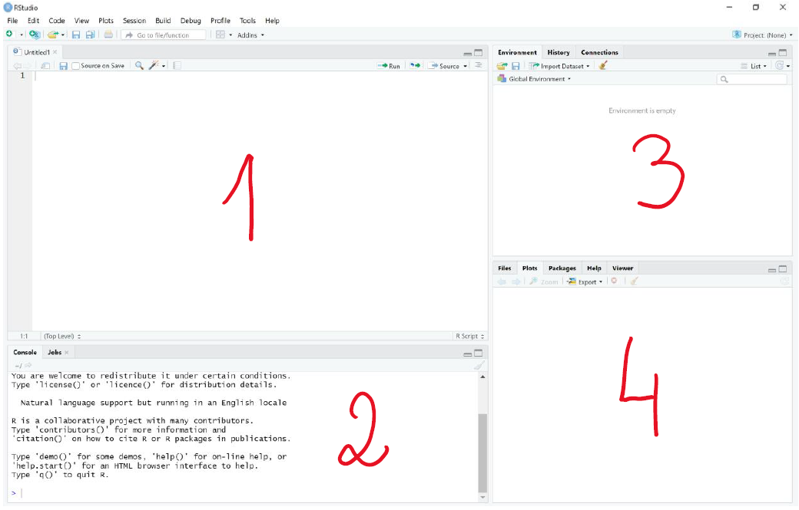
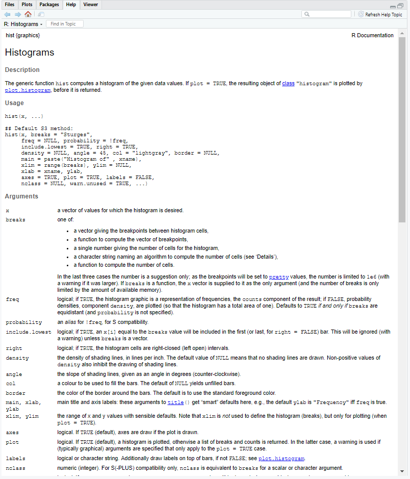

before we can run R we need to install it. We'll also install Rstudio
This video shows how to install R and Rstudio on your pc/mac/linux 
[youtube tutorial](https://www.youtube.com/watch?v=by5HyJX6H1I)

If you are on a BCI IT managed windows machine you should be able to install R and R studio 
without needing admin access. A recent version of R studio is available in the software centre 
(downloading R studio from the internet requires admin access)
However, you will need to install R separately as the version on the software centre is not up to date

## Introducing Rstudio

RStudio has 4 panels 
 
1. Editor. This is where you write your scripts 
2. Console. This is the command line interface where you can run R code, or where the code you select from the script with ctrl+enter (pc) / cmd+enter (mac) get sent to
3. environment pane. This is where the variables you create during the R session get displayed.
4. "magic" pane. This is a panel of many functions, depending on the selected tab it can display the files in the working directory, any plots you produce, a list of packages and an help panel. 



Within Rstudio there are 2 ways to interact with R. You can execute code from a script by selecting it and pressing ctrl+enter (pc) / cmd+enter (mac). This is the best way as the code you execute remains on the script and you can easily run multiple lines. Or you can type your command directly in the console. 

# Introducing R 

before the first session let's introduce some really basic concepts in R which will make following the webinar easy 

## Variables 

Computers have memory. There are two kinds of memory: RAM and Disk memory. The first is where
programes keep the information they need to compute, the second is where the resulting files are kept,
To save something in the computing memory you need to assign its value to a variables. 
Variables can be assigned using <- or = , try to keep it consistent in your scripts

```{r}
apples <- 1
```

While R allows any variable name starting with a letter and not containing symbols there are numerous conventions to
keep variable naming consistent.
This introduces the concept of style, which is how your code looks like to another person, rather than whether it runs correctly.
Keeping a consistent style can help you and others understand your code and avoid bugs. what constitutes a good style 
is a subjective matter, with different conventions used by different projects.
If you are interested see the section about style in the reading tab. 

for now we'll stick to lowercase variable names, with words separated by a `_`

```{r}
foo_bar <- 42
```

Note R will happily overwrite values in a variable without any warning
```{r}
a <- 1
a <- 2
a
```

### Listing and Removing Variables

R handles memory automatically so there is usually no need to manually remove variables. 
Sometimes it is useful to manually remove unused variables to clear the environment pane.
This is done with rm(variable). i.e 
```{r}
rm(a)
```

you can use ls() to list all the variables in the environment
```{r}
ls()
```
combine it with rm to remove everything.
USE THIS WITH CARE
```{r}
rm(list = ls())
```


### Data Modes 

Computers store all information as 0s and 1s. 
R is a dynamically typed language which means R does a pretty good job at figuring what type each variable is while running your code
so there is no normally no need to specify a type, or worry about them.

There are 4 main data modes in r

- logical 
- numeric
- complex
- character

we can check the mode of a variable using `mode(variable)`
```{r}
mode(1)
```

#### Logical Data

logical data can be TRUE (T), FALSE (F) or NA

NA is the way R deals with missing data. we can declare something as not available with `NA`
```{r}
result <- NA
```

```{r}
typeof(result)
```
#### Numeric 

numeric data can come in 2 types: real numbers (double*) and integers.

by default numbers in R are real  
```{r}
typeof(1)
```
To get an integer we add a `L` after the number
```{r}
typeof(1L)
```
there is normally no reason to worry about this distinction beyond noting that factors are integers.

#### Complex Numbers

complex numbers can be represented by adding the imaginary part to a real number
```{r}
typeof(2+1i)
```
#### Characters

R can store text in variable with the character type
R characters are equivalent to what in most languages are called strings. To create a character we quote our text with either single '' or double "" quotes
```{r}
character<- "hello"
```
else R will look for a variable of that name 
```{r ,error=TRUE}
character <- hello
```
every ' must be closed by another ', as so does every ". don't mix the two 
```{r ,error=TRUE}
character <- "hello'
```

## Factors

Traditionally R has represented categorical variables as factors rather
than characters. In factors each category (named level) is assigned an
integer value.

you can create factors by using the factor() function.
```{r}
factor1 <- factor(c("red","green","blue"))
```

```{r}
factor1
```

checking a factor mode and type reveals their underlying representation 
```{r}
mode(factor1)
typeof(factor1)
```

Originally, there was a memory advantage to this and historically R
would automatically convert any character to factors, unless told not
to. From R 4.0 the read.file() and data.frame() have. Although most functions can nowadays
accept characters instead of factors, they can still be useful in some
cases, see [r for data science](https://r4ds.had.co.nz/factors.html).

Remember while some functions have special methods for dealing with factors, 
some treat factors as strings, other as numbers

for instance the median function will correctly refuse to work on a factor but IQR will happily 
calculate an inter quantile range based on the integer value
```{r, error=T}
median(factor1)
```
```{r}
IQR(factor1)
```

# Functions 

R has a library of functions, these are commands you use to perform a specific action. In R functions have a name and some arguments.
You can call a function by using its name and (argument1, argument2). For now focus on the pattern in the calls, we'll see these functions again in session 1. 

for instance we can call sum to add some numbers
```{r}
sum(1, 3, 5, 7)
```

functions have often default values where there is no need to specify an argument 
unless we need a different value from the default

for instance the sequence `seq` function needs only needs a start and an end
number to produce a sequence from 0 to 10
```{r}
seq(0,10)
```

we can however replace the default increment of 1 with 2 by specifying `by = 2`
Think of it as assigning the value to a variable that will be passed to the function . 
Note here we use only = not <- 
```{r}
seq(0,10,by = 2)
```
we can use the name of the arguments to ignore their order, but avoid this as it can get confusing 
```{r}
seq(by = 2, to = 10, from = 0)
```

the ability to change orders becomes useful when we want to leave some arguments in the middle as the default.

Some functions do not require any arguments. However you must still add an empty ().
For instance, getwd() will return the working directory (i.e the folder R is currently opening -- which may be different from the folder your script is)

```{r}
getwd()
```
if you forget the (), R will print some information about the function itself, rather than calling it
```{r}
getwd
```

## Setting the working directory 

We have seen getwd() will print the working directory to the screen.
to change the working directory we can use setwd(). 

Windows paths use `\`, this however has a special meaning in R (an Unix tools in general) as a
character to ignore the next special character, so you need a `\` to tell r to ignore the `\` in the path.
```{r}
setwd("c:\\Users\\deange01\\Documents\\Bioinformatics-cafe-tutorials\\")
```

However R can use Linux/Mac style paths using `/` work windows too.
```{r}
setwd("c:/Users/deange01/Documents/Bioinformatics-cafe-tutorials/")
```

Similarly, by convention the `~` at the beginning of a path points to the home directory on Linux/Mac but 
in R in Windows it points to the document folder.

## Help 

if you are ever stuck with a function adding ? before its name will open the help panel for you. The help panel will describe a function, its
arguments and defaults, often a summary of the methods used, and a usage example.  

for instance, 
```{r}
?hist
```
returns



The information on these help panels can sometimes be very concise and may be confusing at first.
However, as you familiarize with R and the functios they will eventually make sense and can be very good as a quick reference
(i.e if you forget how an argument is named or what it should contain)

## how do the sessions work. 

These workshop are in the spirit of the carpentries [see their material here](https://carpentries.org/), therefore we encourage everyone to run their code alongside the webinar.

During the tutorials you'll sometimes be asked to answer
in this case the solution will be initially hidden. Try to come up with your answer
and run it to check the output before un hiding the code to check it

This is an example of hidden code 
```{r class.source = 'fold-hide'}
print("hello world")
```
## Data Files 

the data files for the 3 sessions are available on [Google Drive](https://drive.google.com/drive/folders/1FQvgPYSPPBNEC8ytuQ2MXUES4H9sHj3c?usp=sharing)

If you have any questions please post them in the Google document for your session, details will be provided with the webinar.

* in R all numbers are 64 bit long, they have double the precision of a 32 bit floating point so that is where double comes from